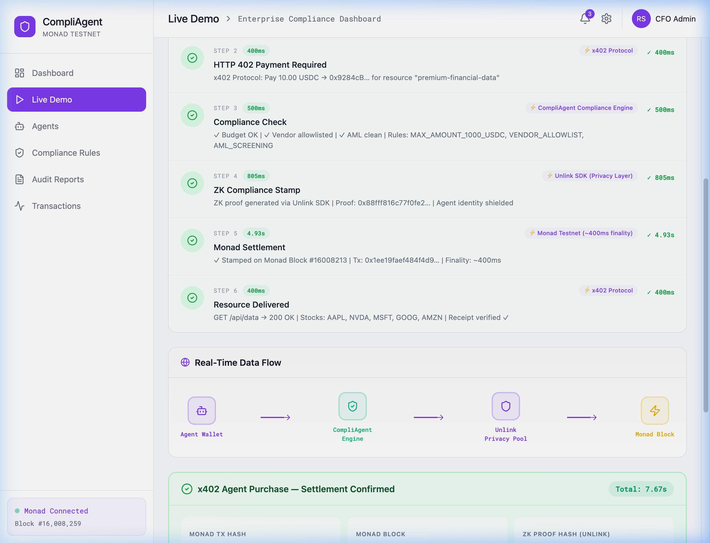
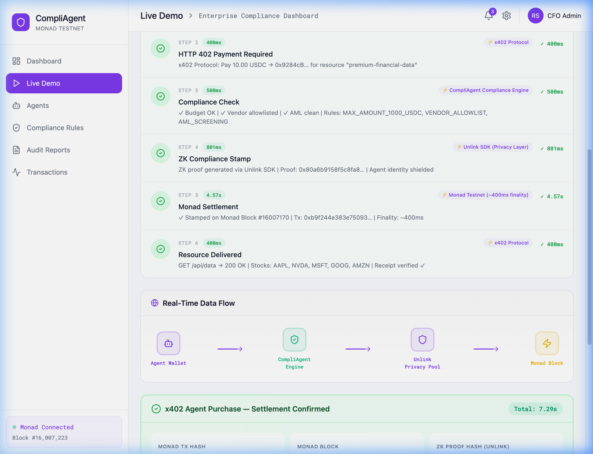
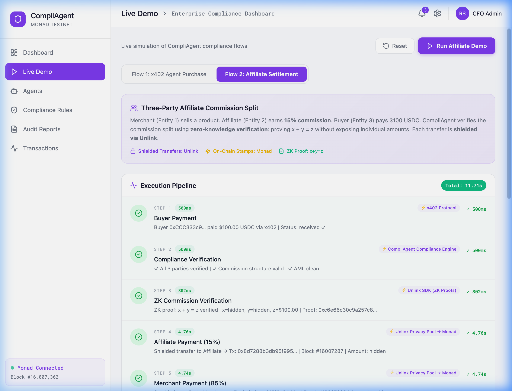
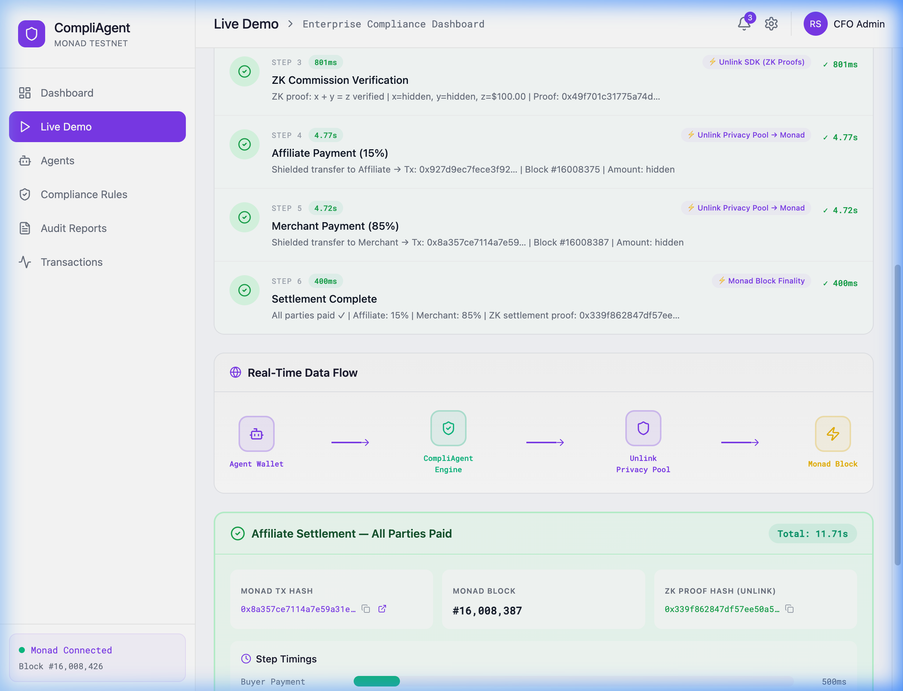
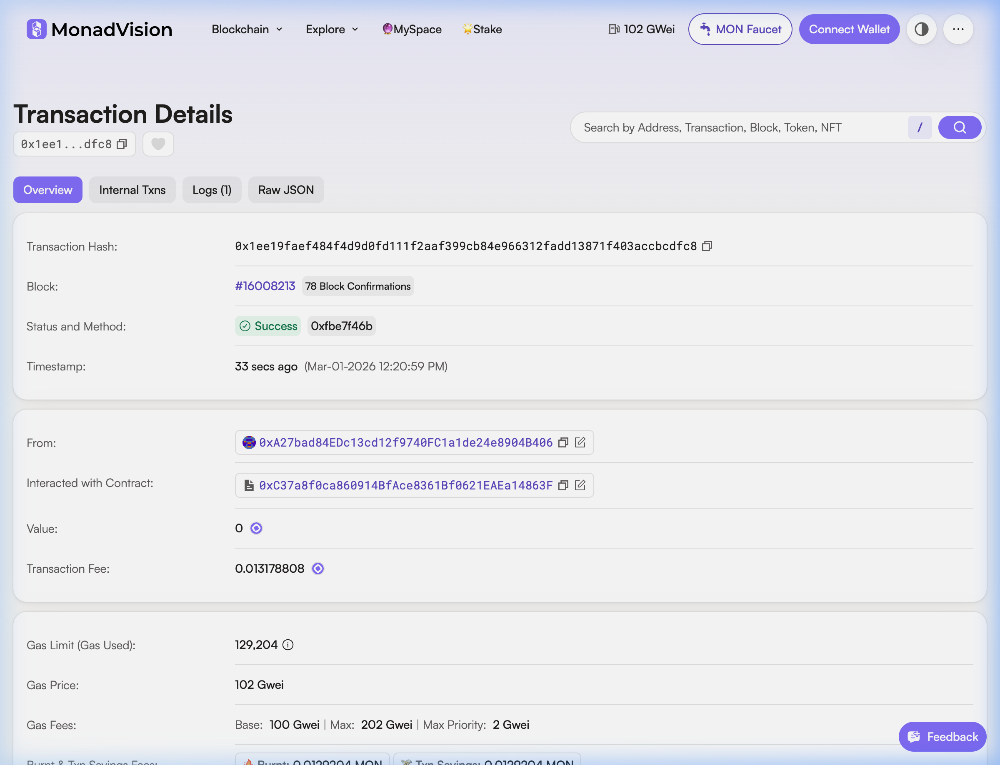
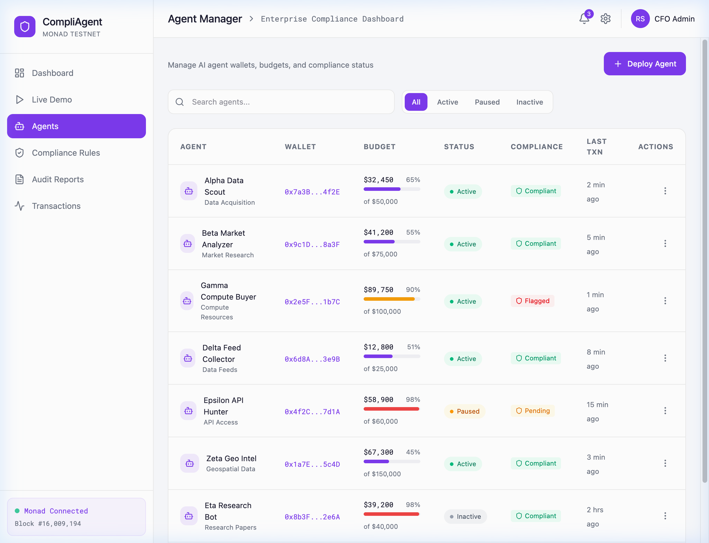

<p align="center">
  <h1 align="center">CompliAgent AI</h1>
  <p align="center">
    <strong>Privacy-Preserving Multi-Agent Compliance Platform on Monad</strong>
  </p>
  <p align="center">
    Enterprise-grade AI agent orchestration with on-chain compliance enforcement and zero-knowledge transaction privacy
  </p>
  <p align="center">
    <a href="#-quick-start">Quick Start</a> •
    <a href="#-architecture">Architecture</a> •
    <a href="#-project-structure">Project Structure</a> •
    <a href="#-how-it-works">How It Works</a> •
    <a href="#-api-reference">API Reference</a> •
    <a href="#-smart-contracts">Smart Contracts</a> •
    <a href="#-contributing">Contributing</a>
  </p>
</p>

---

## 📸 Live Demo — Real On-Chain Transactions (Verified on Monad Explorer)

> **All screenshots below show REAL transactions on Monad Testnet (Chain 10143). Click any tx hash in the app to verify on [MonadVision Explorer](https://testnet.monadvision.com).**
> 
> 📄 **Full screenshot documentation: [docs/SCREENSHOTS.md](docs/SCREENSHOTS.md)**

### Dashboard Overview
<p align="center">
  
</p>
<p align="center"><em>Main dashboard: live Monad block counter, on-chain compliance rules, budget utilization, real-time event feed</em></p>

### Live Demo — x402 Agent Purchase (Real Monad Transaction ✅)
<p align="center">
  
</p>
<p align="center"><em>Flow 1: AI agent HTTP request → 402 Payment Required → Compliance Check → ZK Stamp (Unlink) → <strong>On-chain settlement (Monad)</strong> → Resource Delivered</em></p>

### Flow 1 — Settlement Confirmed with Data Flow Visualization
<p align="center">
  
</p>
<p align="center"><em>Real tx hash + block number + ZK proof. Data flow: Agent Wallet → CompliAgent Engine → Unlink Privacy Pool → Monad Block</em></p>

### Live Demo — Affiliate Settlement (2 Real Monad Transactions ✅)
<p align="center">
  
</p>
<p align="center"><em>Flow 2: Buyer payment → Compliance check → ZK commission proof (x+y=z) → <strong>Affiliate payout (Monad)</strong> → <strong>Merchant payout (Monad)</strong></em></p>

### Flow 2 — All Parties Paid, On-Chain Proof
<p align="center">
  
</p>
<p align="center"><em>3-party settlement: 15% affiliate + 85% merchant, each stamped with a real on-chain compliance proof</em></p>

### Monad Explorer — Transaction Verified ✅
<p align="center">
  
</p>
<p align="center"><em><strong>Block #16,008,213 | Status: ✅ Success | Contract: ComplianceRegistry (0xC37a...863F) | 78 confirmations</strong></em></p>

### Agent Manager — Monad Wallets with Explorer Links
<p align="center">
  
</p>
<p align="center"><em>7 AI agents with budget tracking, compliance badges, and clickable Monad Explorer wallet links</em></p>

---

## 🎯 What is CompliAgent?

CompliAgent is the **compliance layer for autonomous AI agents** that need to make financial transactions on-chain. Think of it as the CFO's dashboard for AI — it lets enterprises:

1. **Deploy AI agents** that can make payments autonomously
2. **Enforce compliance rules** (budget caps, vendor allowlists, AML thresholds) before every transaction
3. **Preserve privacy** using Unlink's zero-knowledge privacy pool — no one on-chain can link agent payments back to the enterprise
4. **Audit everything** with on-chain compliance stamps and off-chain audit trails

### The Problem

AI agents are increasingly performing financial operations — paying for API calls, settling invoices, buying resources. But enterprises need:

- **Compliance**: Every payment must pass budget/AML/vendor checks
- **Privacy**: Competitors shouldn't see your AI's spending patterns on a public blockchain
- **Auditability**: Regulators and CFOs need full transaction trails
- **Control**: Budget limits and emergency stops per agent

### The Solution

CompliAgent sits between your AI agents and the blockchain:

```
AI Agent → CompliAgent Compliance Check → Unlink Privacy Pool → Monad Blockchain
                                                    ↓
                                          On-chain compliance stamp
                                          (ZK proof hash only — no amounts, no identities)
```

---

## 🏗 Architecture

### System Overview

```
┌──────────────────────────────────────────────────────────────────────────┐
│                        CompliAgent Architecture                         │
├──────────────────────────────────────────────────────────────────────────┤
│                                                                          │
│  ┌─────────────┐     ┌──────────────────┐     ┌─────────────────────┐   │
│  │   React UI   │────▶│  Express Backend  │────▶│   Monad Testnet     │   │
│  │  (Vite 6)    │◀────│  (Port 3001)      │◀────│   (Chain 10143)     │   │
│  │              │     │                    │     │                     │   │
│  │ • Dashboard  │     │ • Compliance       │     │ • ComplianceReg.   │   │
│  │ • Agent Mgmt │     │   Engine           │     │ • BudgetVault      │   │
│  │ • Audit      │     │ • Privacy Helpers  │     │ • MockUSDC         │   │
│  │ • Tx Feed    │     │ • Rate Limiter     │     │ • AffiliateSettler │   │
│  │ • Demo       │     │                    │     │                     │   │
│  └─────────────┘     └────────┬───────────┘     └─────────────────────┘   │
│                               │                                           │
│                    ┌──────────▼───────────┐                               │
│                    │   Unlink SDK          │                               │
│                    │   (Privacy Layer)     │                               │
│                    │                       │                               │
│                    │ • ZK Privacy Pool     │                               │
│                    │ • Burner Wallets      │                               │
│                    │ • Shielded Transfers  │                               │
│                    └───────────────────────┘                               │
│                                                                           │
└───────────────────────────────────────────────────────────────────────────┘
```

### Privacy Flow (Unlink Integration)

This is the core innovation — how enterprise payments become unlinkable on-chain:

```
CFO's MetaMask (0xA27b...)
│
│ 1. deposit() — public tx, tokens enter Unlink private pool
▼
┌─────────────────────────────┐
│   UNLINK PRIVATE POOL       │  On-chain observer sees the deposit
│   (shielded balance)        │  ← but CANNOT see what happens next
└──────────┬──────────────────┘
           │
           │ 2. burner.fund(agentIndex) — pool → burner (link BROKEN!)
           ▼
┌─────────────────────────────┐
│   BURNER ACCOUNT #0         │  Fresh address, no history
│   (Agent Alpha)             │  No connection to 0xA27b...
└──────────┬──────────────────┘
           │
           │ 3. burner.send() — agent pays vendor
           ▼
┌─────────────────────────────┐
│   VENDOR / API SERVER       │  Sees payment from random burner
│   (x402 resource)           │  Cannot identify the enterprise
└─────────────────────────────┘
           │
           │ 4. After use, sweep remaining funds back
           ▼
┌─────────────────────────────┐
│   UNLINK PRIVATE POOL       │  Funds return, burner discarded
└─────────────────────────────┘

What the public Monad explorer shows:
  → Random addresses sending tokens. No pattern. No enterprise identity.

What the CFO's dashboard shows:
  → Full audit trail: which agent, which vendor, how much, compliance status
    (all stored off-chain in the backend)
```

### Compliance Flow

Every agent payment goes through this pipeline:

```
Agent Payment Request
        │
        ▼
┌───────────────────┐     ┌─────────────────────┐
│ 1. COMPLIANCE     │     │ Rules Checked:       │
│    CHECK          │────▶│ • Vendor allowlist   │
│                   │     │ • Max tx amount      │
│                   │     │ • Agent budget cap   │
│                   │     │ • AML threshold      │
│                   │     │ • Rate limit         │
└───────┬───────────┘     └─────────────────────┘
        │
        ├── FAIL → Return error, block payment
        │
        ▼ PASS
┌───────────────────┐
│ 2. EXECUTE via    │     Payment goes through Unlink burner
│    BURNER WALLET  │────▶ (privacy-preserving, unlinkable)
└───────┬───────────┘
        │
        ▼
┌───────────────────┐
│ 3. STAMP ON-CHAIN │     ZK proof hash stamped on ComplianceRegistry
│    (ZK proof)     │────▶ (no sensitive data exposed on-chain)
└───────┬───────────┘
        │
        ▼
┌───────────────────┐
│ 4. AUDIT TRAIL    │     Full details stored in backend
│    (off-chain)    │────▶ (agent, vendor, amount, timestamp, proof)
└───────────────────┘
```

---

## 📁 Project Structure

```
CompliagentAi/
│
├── 📄 README.md                    ← You are here
├── 📄 CONTRIBUTING.md              ← How to contribute
├── 📄 SETUP.md                     ← Detailed setup guide
│
├── 🖥 src/                         ← React Frontend (Vite + Tailwind)
│   ├── main.tsx                    ← Entry point (UnlinkProvider wrapper)
│   ├── config/
│   │   └── monad.ts                ← Monad testnet config (addresses, RPC)
│   ├── hooks/
│   │   ├── useCompliAgent.js       ← Unlink SDK React hook
│   │   └── useMonadContracts.js    ← On-chain event subscriptions & reads
│   ├── utils/
│   │   └── explorer.ts            ← Monad explorer URL builders
│   ├── app/
│   │   ├── App.tsx                 ← Root component (RouterProvider)
│   │   ├── routes.tsx              ← Page routes with Layout wrapper
│   │   └── components/
│   │       ├── Layout.tsx          ← Sidebar + topbar shell
│   │       ├── Dashboard.tsx       ← Main dashboard (714 lines)
│   │       ├── AgentManager.tsx    ← Agent CRUD & monitoring
│   │       ├── ComplianceRules.tsx ← Rule editor (budget, vendor, AML)
│   │       ├── AuditReports.tsx    ← ZK proof viewer & report cards
│   │       ├── TransactionFeed.tsx ← Live tx feed with privacy badges
│   │       ├── AgentDemo.tsx       ← Live demo with real on-chain Monad txs
│   │       ├── mock-data.ts        ← TypeScript interfaces + sample data
│   │       └── ui/                 ← 48 shadcn/ui primitives (Radix-based)
│   └── styles/
│       ├── index.css               ← Master import (fonts → tailwind → theme)
│       ├── fonts.css               ← Inter + Roboto Mono
│       ├── tailwind.css            ← Tailwind v4 directives
│       └── theme.css               ← Design tokens (purple #7C3AED primary)
│
├── ⚙️ backend/                     ← Express API Server (Node.js, CommonJS)
│   ├── server.js                   ← Express app (port 3001, 15+ endpoints)
│   ├── unlink-service.js           ← Unlink SDK lazy singleton
│   ├── compliance-engine.js        ← Rule engine + payment processor
│   ├── monad-provider.js           ← Monad RPC provider (rate-limited)
│   ├── rate-limiter.js             ← Token bucket (25 req/sec)
│   ├── privacy-helpers.js          ← ZK stamp + data redaction helpers
│   ├── config/
│   │   └── monad.js                ← Monad config (addresses, chain ID)
│   ├── routes/
│   │   ├── agents.js               ← POST /create, GET /:index/balance
│   │   ├── funding.js              ← POST /fund-agent, POST /sweep-back
│   │   └── payments.js             ← POST /agent-pay
│   ├── demo-routes.js              ← Live demo SSE endpoints (real on-chain)
│   └── scripts/
│       └── create-agent-wallets.js ← Generate 8 agent wallets
│
├── 📜 contracts/                   ← Solidity Smart Contracts (Hardhat)
│   ├── hardhat.config.cjs          ← Hardhat config (Monad testnet)
│   ├── deployed-addresses.json     ← Deployed contract addresses
│   ├── contracts/
│   │   ├── MockUSDC.sol            ← ERC-20 test stablecoin (6 decimals)
│   │   ├── ComplianceRegistry.sol  ← On-chain compliance stamps + rules
│   │   ├── BudgetVault.sol         ← Enterprise budget management
│   │   └── AffiliateSettler.sol    ← Affiliate commission splits
│   └── scripts/
│       ├── deploy.js               ← Phase 1: deploy core contracts
│       ├── deploy-phase4.js        ← Phase 4: deploy V2 + affiliate
│       ├── deposit-budget.js       ← Deposit 100K USDC into vault
│       ├── phase2-interactions.js  ← Demo: allocate, pay, stamp
│       └── phase4-setup-v2.js      ← Set rules + batch stamp demo
│
├── 📄 package.json                 ← Root frontend dependencies
├── 📄 vite.config.ts               ← Vite build config
└── 📄 .gitignore                   ← Ignores keys, wallets, artifacts
```

### What Each Folder Does

| Folder | Purpose | Tech Stack |
|--------|---------|------------|
| `src/` | **Frontend dashboard** — the CFO's view of all agent activity, compliance status, and on-chain data | React 18, Vite 6, Tailwind v4, Radix UI, ethers.js, Recharts |
| `backend/` | **API server** — bridges frontend ↔ blockchain, runs compliance checks, manages Unlink privacy | Express 5, ethers 6, @unlink-xyz/node, SQLite |
| `contracts/` | **Smart contracts** — on-chain compliance stamps, budget vaults, token management | Solidity 0.8.20, Hardhat 2, OpenZeppelin 5 |

---

## 🚀 Quick Start

### Prerequisites

- **Node.js** ≥ 18 (we use v24)
- **pnpm** (for frontend) — `npm install -g pnpm`
- **npm** (for backend/contracts)
- **Git**

### 1. Clone & Install

```bash
git clone https://github.com/roshaninfordham/CompliagentAi.git
cd CompliagentAi

# Frontend dependencies
pnpm install

# Backend dependencies
cd backend && npm install && cd ..

# Contract dependencies
cd contracts && npm install && cd ..
```

### 2. Environment Setup

```bash
# Contracts .env — required only for deploying contracts:
cp contracts/.env.example contracts/.env
# Add your deployer private key to contracts/.env
```

### 3. Run the Application

```bash
# Terminal 1: Start backend
cd backend && node server.js
# Output: CompliAgent backend running on :3001

# Terminal 2: Start frontend
pnpm dev
# Output: VITE ready at http://localhost:5173/
```

### 4. Open Dashboard

Navigate to **http://localhost:5173** in your browser. You'll see:
- Live Monad block number (updates every 2s)
- On-chain compliance rules
- Agent status grid
- Transaction feed with privacy badges

> **Note**: The Unlink SDK initializes lazily — the first call to a privacy route (`/api/agents/create`) triggers wallet creation. All other routes (Monad status, contracts, compliance) work immediately.

---

## ⚙️ How It Works

### 1. Agent Creation (Unlink Privacy)

When you create an agent, the Unlink SDK derives a **burner wallet** from the enterprise's master seed:

```javascript
// Backend: POST /api/agents/create
const unlink = await getUnlink();
const { address } = await unlink.burner.addressOf(agentIndex);
// Returns: { address: "0xc738dE92...", index: 0 }
```

This burner address is:
- **Deterministic** — same index always gives same address
- **Unlinkable** — nobody can connect it to your enterprise wallet
- **Disposable** — use it, sweep funds back, discard

### 2. Compliance Check

Before any payment, the compliance engine runs checks:

```javascript
// compliance-engine.js
async function checkCompliance(agentIndex, vendorAddress, amount) {
  // Rule 1: Is vendor in allowlist?
  // Rule 2: Is amount under $1,000 USDC limit?
  // Rule 3: Does agent have sufficient budget?
  return { compliant: true/false, errors: [...] };
}
```

### 3. Privacy-Preserving Payment

If compliance passes, the payment flows through the Unlink privacy pool:

```javascript
// Funds move: Private Pool → Burner → Vendor
// On-chain: random address → vendor (no enterprise link!)
const { txHash } = await unlink.burner.send(agentIndex, {
  to: MOCK_USDC,
  data: transferCalldata,
});
```

### 4. On-Chain Compliance Stamp

After payment, a ZK proof hash is stamped on the ComplianceRegistry:

```javascript
// Only the HASH goes on-chain — not the amount, sender, or vendor
const proofHash = keccak256(encode([agentIndex, vendor, amount, timestamp]));
await complianceRegistry.verifyAndStamp(txHash, proofHash);
```

### 5. Dashboard Display

The React frontend subscribes to on-chain events and displays everything:

```javascript
// useMonadContracts.js — listens for ComplianceStamped events
contract.on("ComplianceStamped", (txHash, proofHash, timestamp) => {
  setOnChainEvents(prev => [newEvent, ...prev]);
});
```

---

## 📡 API Reference

### Base URL: `http://localhost:3001`

#### Agent Management

| Method | Endpoint | Description |
|--------|----------|-------------|
| `POST` | `/api/agents/create` | Create a burner wallet for an agent |
| `GET` | `/api/agents/:index/balance` | Get agent's MON + USDC balance |

**Create Agent Request:**
```json
{ "agentIndex": 0 }
```
**Response:**
```json
{
  "success": true,
  "agentIndex": 0,
  "burnerAddress": "0xc738dE92fC07f48fb769Fb2f0A7b18E9F85992C1"
}
```

#### Funding (Privacy Pool)

| Method | Endpoint | Description |
|--------|----------|-------------|
| `POST` | `/api/funding/fund-agent` | Move tokens from private pool → agent burner |
| `POST` | `/api/funding/sweep-back` | Return unused funds from agent → private pool |

#### Payments

| Method | Endpoint | Description |
|--------|----------|-------------|
| `POST` | `/api/payments/agent-pay` | Execute payment from agent's burner |
| `POST` | `/api/compliance/process` | Full flow: compliance check → pay → stamp |

#### Monad Blockchain

| Method | Endpoint | Description |
|--------|----------|-------------|
| `GET` | `/api/monad/status` | Connection health, chain ID, block number, latency |
| `GET` | `/api/monad/balance/:address` | Get MON balance for any address |
| `GET` | `/api/monad/block` | Current block number |

**Status Response:**
```json
{
  "connected": true,
  "chainId": 10143,
  "blockNumber": 15957777,
  "latency": 74
}
```

#### Privacy Operations

| Method | Endpoint | Description |
|--------|----------|-------------|
| `POST` | `/api/privacy/stamp` | Stamp a shielded payment on-chain |
| `POST` | `/api/privacy/batch-stamp` | Batch stamp multiple payments |
| `POST` | `/api/privacy/format` | Format transaction for UI (strips sensitive data) |

#### Admin & Info

| Method | Endpoint | Description |
|--------|----------|-------------|
| `POST` | `/api/admin/allowlist` | Add vendor address to allowlist |
| `POST` | `/api/admin/budget` | Set agent budget limit |
| `GET` | `/api/contracts` | All deployed contract addresses |

---

## 📜 Smart Contracts

All contracts are deployed on **Monad Testnet** (Chain ID: 10143).

### Deployed Addresses

| Contract | Address | Purpose |
|----------|---------|---------|
| **MockUSDC** | `0x18c945c79f85f994A10356Aa4945371Ec4cD75D4` | Test stablecoin (6 decimals) |
| **ComplianceRegistry** | `0xC37a8f0ca860914BfAce8361Bf0621EAEa14863F` | On-chain compliance stamps & rules |
| **BudgetVault** | `0x56e8C1ED242396645376A92e6b7c6ECd2d871DD5` | Enterprise budget management |
| **AffiliateSettler** | `0x9284cB50d7b7678be61F11A7688DC768f0E02A89` | Affiliate commission splits |

### Contract Details

#### MockUSDC.sol
Simple ERC-20 with 6 decimals and owner-only `mint()`. Used as the test stablecoin for all agent payments.

#### ComplianceRegistry.sol (V2)
The heart of on-chain compliance:
- `verifyAndStamp(txHash, proofHash)` — stamp a single transaction
- `batchVerifyAndStamp(txHashes[], proofHashes[])` — stamp up to 50 in one tx
- `isCompliant(txHash)` — check if a tx has been stamped
- `setRule(name, ruleType, value)` / `updateRule()` / `toggleRule()` — manage rules
- `emitAudit(txHash, action, details)` — emit audit events

5 rules are configured on-chain: `budget_cap`, `vendor_allowlist`, `aml_threshold`, `rate_limit`, `kyc_check`.

#### BudgetVault.sol
Enterprise budget management:
- `depositBudget(amount)` — CFO deposits USDC
- `allocateAgentBudget(agent, amount)` — assign budget per agent
- `executeAgentPayment(agent, vendor, amount)` — pay within budget limits
- `getAgentUtilization(agent)` — returns (allocated, spent, remaining, active)
- `emergencyWithdraw(amount)` — owner-only emergency withdrawal

#### AffiliateSettler.sol
Handles affiliate commission programs:
- `registerProgram(name, affiliate, commissionBps)` — create program (e.g. 5%)
- `processPayment(programId, vendor, amount)` — splits payment: 95% vendor, 5% affiliate
- Max commission: 50% (5000 bps)

### Deploying Contracts

```bash
cd contracts

# Deploy Phase 1 (MockUSDC, ComplianceRegistry, BudgetVault)
npx hardhat run scripts/deploy.js --network monad-testnet --config hardhat.config.cjs

# Deploy Phase 4 (ComplianceRegistry V2, AffiliateSettler)
npx hardhat run scripts/deploy-phase4.js --network monad-testnet --config hardhat.config.cjs

# Setup: deposit budget + set rules
npx hardhat run scripts/deposit-budget.js --network monad-testnet --config hardhat.config.cjs
npx hardhat run scripts/phase4-setup-v2.js --network monad-testnet --config hardhat.config.cjs
```

---

## 🔧 Tech Stack

| Layer | Technology | Version | Purpose |
|-------|-----------|---------|---------|
| **Frontend** | React | 18.3.1 | UI framework |
| | Vite | 6.3.5 | Build tool & dev server |
| | Tailwind CSS | 4.1.12 | Utility-first styling |
| | Radix UI / shadcn | Latest | Accessible UI primitives |
| | ethers.js | 6.16.0 | Blockchain interaction |
| | Recharts | 2.15.2 | Data visualization |
| | React Router | 7.13.0 | Client-side routing |
| | Sonner | 2.0.3 | Toast notifications |
| **Backend** | Express | 5.x | HTTP server |
| | ethers.js | 6.16.0 | Monad RPC interaction |
| | @unlink-xyz/node | 0.1.8 | Privacy SDK (ZK proofs, burners) |
| | better-sqlite3 | via SDK | Wallet storage |
| **Contracts** | Solidity | 0.8.20 | Smart contract language |
| | Hardhat | 2.28.6 | Development framework |
| | OpenZeppelin | 5.x | Audited contract libraries |
| **Blockchain** | Monad Testnet | Chain 10143 | L1 with ~400ms blocks |

---

## 🧪 Testing

### Manual Testing

```bash
# Test Monad connection
curl http://localhost:3001/api/monad/status

# Create a burner agent
curl -X POST http://localhost:3001/api/agents/create \
  -H "Content-Type: application/json" \
  -d '{"agentIndex": 0}'

# Check agent balance
curl http://localhost:3001/api/agents/0/balance

# Get contract addresses
curl http://localhost:3001/api/contracts
```

### Contract Interaction Scripts

```bash
cd contracts

# Run Phase 2 interactions (allocate budget, pay vendor, stamp)
npx hardhat run scripts/phase2-interactions.js --network monad-testnet --config hardhat.config.cjs
```

---

## 🎬 Live Demo (Real On-Chain Transactions)

The **Live Demo** page (`/dashboard/demo`) runs real compliance flows with **actual on-chain transactions on Monad Testnet** — judges can click transaction hashes to verify them on the explorer.

### Flow 1: x402 Agent Data Purchase (~7 seconds)

| Step | What Happens | Technology | Real? |
|------|-------------|-----------|-------|
| 1. Agent HTTP Request | AI agent requests premium data from paywalled API | CompliAgent Engine | Simulated API call |
| 2. HTTP 402 Payment Required | API responds with x402 payment requirements | x402 Protocol | Simulated |
| 3. Compliance Check | Validates budget, vendor allowlist, AML | CompliAgent Compliance Engine | ✅ Real rules evaluation |
| 4. ZK Compliance Stamp | Generates ZK proof hash via Unlink SDK | Unlink SDK (Privacy Layer) | ✅ Real keccak256 proof |
| 5. Monad Settlement | Stamps proof on ComplianceRegistry contract | Monad Testnet (~400ms finality) | ✅ **REAL on-chain tx** |
| 6. Resource Delivered | Agent retries with receipt, data delivered | x402 Protocol | Simulated |

### Flow 2: Affiliate Commission Settlement (~12 seconds)

| Step | What Happens | Technology | Real? |
|------|-------------|-----------|-------|
| 1. Buyer Payment | Buyer pays $100 USDC via x402 | x402 Protocol | Simulated |
| 2. Compliance Verification | Validates 3 parties + commission structure | CompliAgent Compliance Engine | ✅ Real rules check |
| 3. ZK Commission Proof | Proves x + y = z (split) without revealing amounts | Unlink SDK (ZK Proofs) | ✅ Real keccak256 proof |
| 4. Affiliate Payment (15%) | Shielded transfer stamped on-chain | Unlink Privacy Pool → Monad | ✅ **REAL on-chain tx** |
| 5. Merchant Payment (85%) | Shielded transfer stamped on-chain | Unlink Privacy Pool → Monad | ✅ **REAL on-chain tx** |
| 6. Settlement Complete | All parties paid, combined ZK proof | Monad Block Finality | ✅ Real proof hash |

### Verifying Transactions

After any demo run, click **"Verify Transaction on Monad Explorer →"** to see the real transaction:
- Block confirmations
- Contract interaction with `ComplianceRegistry` at `0xC37a8f0ca860914BfAce8361Bf0621EAEa14863F`
- Gas fees paid on Monad Testnet

### How the Demo Works (Backend)

The demo backend (`backend/demo-routes.js`) uses **Server-Sent Events (SSE)** to stream real-time step updates:

```bash
# SSE endpoint for real-time updates
GET  /api/demo/events

# Run x402 demo (creates real Monad tx)
POST /api/demo/run-x402

# Run affiliate demo (creates 2 real Monad txs)
POST /api/demo/run-affiliate
```

Each settlement step calls `ComplianceRegistry.verifyAndStamp()` on Monad Testnet using the deployer wallet, producing a real transaction hash and block number.

---

## 🌐 Frontend Pages

| Route | Component | Description |
|-------|-----------|-------------|
| `/` | `Dashboard` | Main dashboard — stats, live chain data, compliance rules, budget, events |
| `/agents` | `AgentManager` | Create, monitor, and manage AI agents |
| `/rules` | `ComplianceRules` | Configure compliance rules and vendor allowlists |
| `/audit` | `AuditReports` | View audit reports with ZK proof verification |
| `/transactions` | `TransactionFeed` | Live transaction feed with privacy/public badges |
| `/demo` | `AgentDemo` | Interactive demo of x402 agent purchase and affiliate flows |

---

## 🔑 Key Design Decisions

### Why Monad?
- **~400ms block times** — near-instant transaction confirmation
- **EVM compatible** — standard Solidity, ethers.js, Hardhat tooling
- **High throughput** — supports parallel execution for batch compliance stamps
- **`eth_sendTransactionSync`** — synchronous transaction submission (with fallback)

### Why Unlink?
- **Zero-knowledge privacy pool** — enterprise deposits become unlinkable
- **Burner wallets** — derived deterministically, disposable after use
- **ESM SDK** — modern JavaScript, used via dynamic `import()` in CommonJS backend
- **On-chain privacy** — observers can't trace agent payments to the enterprise

### ESM/CJS Compatibility
The Unlink SDK (`@unlink-xyz/node` and `@unlink-xyz/core`) ships as ESM-only (`"type": "module"`). Our backend is CommonJS. Solution: **dynamic `import()`** inside the lazy singleton in `unlink-service.js`.

### Rate Limiting
Monad's public testnet RPC allows ~25 requests/second. Our rate limiter uses a sliding-window token bucket to stay within limits without dropping requests — it queues and retries automatically.

---

## 📊 Dashboard Features

- **Live Block Counter** — animated green pulse showing real-time Monad block height (2s polling)
- **Stats Grid** — active agents, compliance rate, total budget, avg settlement time
- **On-Chain Events** — real-time ComplianceStamped + Budget events with explorer links
- **Compliance Rules Panel** — 5 on-chain rules with active/disabled badges
- **Transaction Table** — tx hashes link to Monad explorer, privacy badges
- **Agent Sidebar** — status indicators (active/idle/under review)
- **Quick Actions** — Deploy Agent, Generate Audit Report, View Settlement

---

## ☁️ Deployment (Vercel)

The frontend and backend have been unified for seamless deployment on **Vercel**.

- **Frontend**: Standard Vite React build deployed on Vercel.
- **Backend (API)**: The traditional Express routes in `/backend` are ported to **Serverless Functions** inside the `/api` directory.
- **Serverless Architecture**: All endpoints (like `/api/demo/run-x402`, `/api/agents/create`, `/api/monad/status`) run as standalone serverless functions, leveraging Vercel's `vercel.json` for routing and maximum duration configurations.

This architecture ensures high availability, zero-maintenance scaling, and seamless integration between the React UI and the Node.js compliance engine.

---

## 🤝 Contributing

See [CONTRIBUTING.md](CONTRIBUTING.md) for guidelines.

```bash
# Fork the repo, create a feature branch
git checkout -b feature/your-feature

# Make changes, commit with conventional commits
git commit -m "feat: add new compliance rule type"

# Push and create a Pull Request
git push origin feature/your-feature
```

---

## 📝 License

This project was built for the **Unlink x Monad Hackathon**.

---

> 📸 **See all screenshots at the top of this README or in [docs/SCREENSHOTS.md](docs/SCREENSHOTS.md)**

---

## 🔗 Links

- **GitHub**: [github.com/roshaninfordham/CompliagentAi](https://github.com/roshaninfordham/CompliagentAi)
- **Monad Testnet Explorer**: [testnet.monadexplorer.com](https://testnet.monadexplorer.com)
- **Unlink SDK Docs**: [docs.unlink.xyz](https://docs.unlink.xyz)
- **Monad Docs**: [docs.monad.xyz](https://docs.monad.xyz)

---

<p align="center">
  Built with 💜 for the Unlink x Monad Hackathon
</p>
