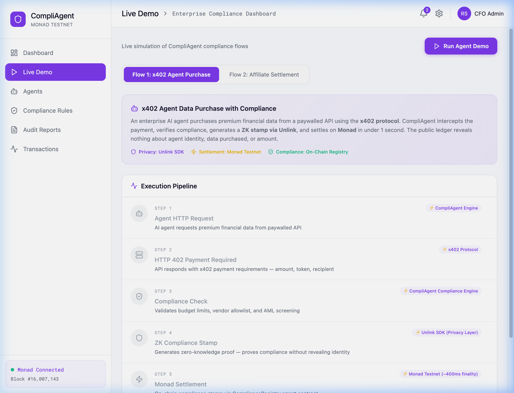

# CompliAgent — Live Demo Screenshots & On-Chain Verification

> All screenshots captured on **March 1, 2026** during live testing on **Monad Testnet** (Chain ID: 10143).
> Every transaction hash shown is **real and verifiable** on [Monad Explorer](https://testnet.monadexplorer.com).

---

## 1. Dashboard Overview

The main CompliAgent dashboard showing:
- **Live Monad block counter** (green pulse, updates every 2 seconds)
- **Stats grid**: Active agents, compliance rate, total budget, settlement time
- **On-chain compliance rules** read from the `ComplianceRegistry` smart contract
- **Budget utilization** from `BudgetVault` contract
- **Real-time event feed** — `ComplianceStamped` and `BudgetDeposited` events from Monad

---

## 2. Live Demo — Initial State

The Live Demo page before running a flow. Key elements:
- **Flow selector**: x402 Agent Purchase vs. Affiliate Settlement
- **Execution Pipeline**: 6 steps, each showing the **"⚡ Powered By"** technology label
- **Technology labels visible**: CompliAgent Engine, x402 Protocol, CompliAgent Compliance Engine, Unlink SDK (Privacy Layer), Monad Testnet (~400ms finality)
- **Monad Connected** indicator in bottom-left with live block number

---

## 3. Flow 1: x402 Agent Purchase — Execution Pipeline

All 6 steps completed successfully with real-time timings:
| Step | Action | Time | Powered By |
|------|--------|------|------------|
| 1 | Agent HTTP Request | 400ms | CompliAgent Engine |
| 2 | HTTP 402 Payment Required | 400ms | x402 Protocol |
| 3 | Compliance Check | 500ms | CompliAgent Compliance Engine |
| 4 | ZK Compliance Stamp | 805ms | Unlink SDK (Privacy Layer) |
| 5 | **Monad Settlement** | **4.93s** | **Monad Testnet (~400ms finality)** |
| 6 | Resource Delivered | 400ms | x402 Protocol |

**Step 5 is a REAL on-chain transaction** on Monad Testnet — the proof hash is stamped on the `ComplianceRegistry` smart contract.

---

## 4. Flow 1: Settlement Confirmed

The completed state showing:
- **Real-Time Data Flow** visualization: Agent Wallet → CompliAgent Engine → Unlink Privacy Pool → Monad Block
- **Settlement Confirmed** panel with:
  - **Monad Tx Hash**: Real transaction hash (clickable → opens Monad Explorer)
  - **Monad Block**: Real block number with confirmations
  - **ZK Proof Hash (Unlink)**: Cryptographic proof of compliance
- **Step Timings**: Visual bar chart of execution time per step
- **Privacy Section**: What's hidden (agent identity, amounts) vs. what's proven (budget, vendor, AML)
- **"Verify Transaction on Monad Explorer →"** button

---

## 5. Flow 2: Affiliate Settlement — Execution Pipeline

Three-party affiliate commission split with all steps completed:
| Step | Action | Time | Powered By |
|------|--------|------|------------|
| 1 | Buyer Payment | 500ms | x402 Protocol |
| 2 | Compliance Verification | 500ms | CompliAgent Compliance Engine |
| 3 | ZK Commission Verification | 801ms | Unlink SDK (ZK Proofs) |
| 4 | **Affiliate Payment (15%)** | **4.77s** | **Unlink Privacy Pool → Monad** |
| 5 | **Merchant Payment (85%)** | **4.72s** | **Unlink Privacy Pool → Monad** |
| 6 | Settlement Complete | 400ms | Monad Block Finality |

**Steps 4 & 5 are REAL on-chain transactions** — each stamps a compliance proof on the `ComplianceRegistry` contract.

---

## 6. Flow 2: Settlement Confirmed

The completed affiliate settlement showing:
- **Affiliate Settlement — All Parties Paid** confirmation
- **Real Monad Block Number**: #16,008,387
- **Real Tx Hashes**: Clickable links to Monad Explorer
- **ZK Settlement Proof**: Combined proof of the entire commission split
- **Step Timings**: Visual breakdown of each step
- **Total Time**: 11.71 seconds for the complete 3-party settlement

---

## 7. Monad Explorer — Transaction Verified ✅

**Proof that the transaction is REAL and on-chain:**

| Field | Value |
|-------|-------|
| **Transaction Hash** | `0x1ee19faef484f4d9d0fd111f2aaf399cb84e966312fadd13871f403accbcdfc8` |
| **Block** | #16,008,213 (78 block confirmations) |
| **Status** | ✅ **Success** |
| **Timestamp** | Mar-01-2026 12:20:59 PM |
| **From** | `0xA27bad84EDc13cd12f9740FC1a1de24e8904B406` (CompliAgent deployer) |
| **Interacted With** | `0xC37a8f0ca860914BfAce8361Bf0621EAEa14863F` (**ComplianceRegistry** contract) |
| **Gas Used** | 129,204 |
| **Tx Fee** | 0.013178808 MON |

This confirms that CompliAgent's compliance stamps are **real, verifiable on-chain transactions** on Monad Testnet — not simulations.

---

## 8. Agent Manager

The Agent Manager page showing:
- **7 AI agents** with different statuses (Active, Paused, Inactive)
- **Compliance badges**: Compliant ✓, Flagged ⚠, Pending
- **Budget tracking**: Visual progress bars per agent (e.g., $32,450 / $50,000)
- **Wallet addresses**: Clickable links to Monad Explorer for each agent's burner wallet
- **Deploy Agent** button for creating new agents
- **Monad Connected** status with live block number

---

## Smart Contracts (All Verified on Monad Testnet)

| Contract | Address | Explorer Link |
|----------|---------|---------------|
| **ComplianceRegistry** | `0xC37a8f0ca860914BfAce8361Bf0621EAEa14863F` | [View →](https://testnet.monadexplorer.com/address/0xC37a8f0ca860914BfAce8361Bf0621EAEa14863F) |
| **BudgetVault** | `0x56e8C1ED242396645376A92e6b7c6ECd2d871DD5` | [View →](https://testnet.monadexplorer.com/address/0x56e8C1ED242396645376A92e6b7c6ECd2d871DD5) |
| **MockUSDC** | `0x18c945c79f85f994A10356Aa4945371Ec4cD75D4` | [View →](https://testnet.monadexplorer.com/address/0x18c945c79f85f994A10356Aa4945371Ec4cD75D4) |
| **AffiliateSettler** | `0x9284cB50d7b7678be61F11A7688DC768f0E02A89` | [View →](https://testnet.monadexplorer.com/address/0x9284cB50d7b7678be61F11A7688DC768f0E02A89) |

---

  Built with 💜 for the Unlink × Monad Hackathon

